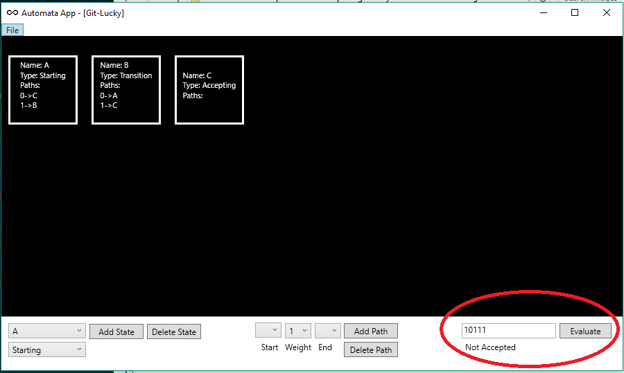

# CPTS 322
[](https://build.mathewmerrick.com/job/git-lucky)

## Devs
- Jomar Dimaculangan (Contact Person) : j.dimaculangan@wsu.edu 
- Mathew Merrick : 
- Devon Honig : 

git-lucky will be creating a deterministic finite automata machine which will allow users to load, create, save and edit and check to see if a string exists within a DFA.

In the root directory, there are three folders:

- AutomataConsole: This is a Console based UI for interacting with AutomataEngine
- AutomataEngine: Load, Save and Create a DFA, and then test whether or not a string exists within the DFA
- AutomataWPF: [In Progress] A workspace for a GUI later on

**AutomataConsole should be the primary interface at this time (10/31/2016)**

When building and running AutomataConsole, the user is presented with a pseudo "shell" where specific commands can be run.


- ```load demo``` Loads an example automata, found in the root directory, ```demo.xml```.
- ```load existing``` Prompts for a full file path to an existing FA with the current DFA XML paradigm.
- ```start``` Initiates the process to create a DFA

---
The DFA created by ```load demo``` has a structure as follows

*State A:*
- Starting
- Path: 1, B
- Path: 0, C

*State B:*
- Transition
- Path: 0, A
- Path: 1, C

*State C:*
- Accepting

Once the DFA has been loaded there are three commands available:

---
The DFA created by ```start``` is as follows
- ```add state``` allows a user to create a state
  - A state name must be a single character, alphanumeric. (I.e. 'A', 'B', 'C')
  - The state type must be one of three types ```Starting```, ```Transition```, or ```Accepting```. There can only be one ```Starting``` state in a DFA.
- ```add path``` allows a user to create a path between two states. The starting state and ending state are single character alphanumeric characters. The weight indicates a number, either a ```1``` or a ```0``` accepted by that path. 
- ```done``` moves on to the next state of the app

---

- ```check``` Check to see if a string exists in a DFA. (For example, in the preloaded DFA, 1011 is accepted, but 1111 is not)
- ```quit``` Exits the program
- ```save``` Saves the current DFA to ```demo.save.xml``` in the root directory


---

Below is an example of using the WPF to interact with a DFA

## Load a DFA from an XML file


## Use the controls in the bottom right to check to see if a state is accepted by the DFA



## Create a Custom DFA using the Add State and/or Add Path controls
Note: Duplicate states cannot be created, and paths will be overwritten. Also, there can only be one starting state in a DFA.
Word accepted in custom DFA made in UI:


Word not accepted in custom DFA made in UI:


